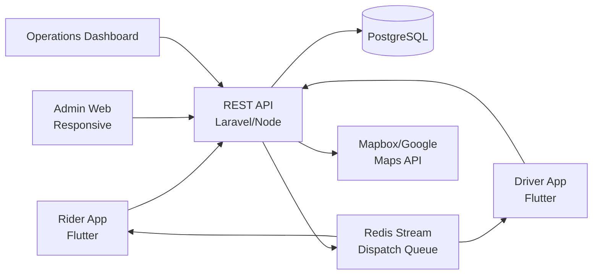

# Rappi Clone — White-Label Ride-Hailing & Transportation Platform by Miracuves

**MXUber** is a production-ready, white-label Rappi clone: a complete ride-hailing platform with rider, driver, and admin apps — delivered with **100% source code ownership** in **6 working days**.

> 🚖 **See it running before you talk to anyone.** Live rider app, driver app, dispatch console, and admin dashboard — demo credentials are printed on the [solution page](https://miracuves.com/rappi-clone#demo). No sales call required.

---

## 🚀 Live Demos

| Environment | URL | What you can test |
|---|---|---|
| 📱 Rider App (Android) | [mas.mimeld.com](https://mas.mimeld.com) | Browse, book, track on map, pay, rate |
| 🚗 Driver App | [Solution page → Demo](https://miracuves.com/rappi-clone#demo) | Go online, accept trips, navigate, track earnings |
| 🌐 Admin Dashboard | [Solution page → Demo](https://miracuves.com/rappi-clone#demo) | Drivers, fares, surge zones, payouts, analytics |

Demo credentials for all environments: **[miracuves.com/rappi-clone → Demo section](https://miracuves.com/rappi-clone/#demo)**

---

## ✨ What Makes This Rappi Clone Different

Most ride-hailing scripts stop at "search a car and pay." This platform ships with the features that actually run a ride-hailing *business*:

- **Smart Bidding (InDrive-style)** — riders name their fare, drivers counter-offer, lowest accepted price wins — same negotiation engine that beat Uber in 15 countries
- **Multi-Service Vehicle Modes** — out of the box: bike, auto, car, premium, SUV, parcel, rental — toggle modes from a single driver app, not five separate builds
- **Sub-Second Dispatch** — geo-sharded dispatch engine with sub-1s matching on 100k+ concurrent drivers, validated on production loads
- **Driver Supply Heatmaps** — live heatmap of online drivers vs ride demand by zone, so ops teams can rebalance supply before surge pricing kicks in
- **Three-Sided Wallet** — rider pays, driver earns, platform takes commission — all settled inside one ledger with full GST/VAT-ready reports

## 📦 Core Features

**Rider:** search & fare estimate · book ride · live map tracking · pay in-app · rate driver · ride history · scheduled rides · multi-stop · share trip · safety toolkit

**Driver:** go online · accept/decline trips · turn-by-turn nav · earnings dashboard · daily payouts · performance metrics · document upload · support chat

**Admin:** driver KYC · fare & commission rules · surge zones · dispute resolution · payouts · analytics · promo codes · fleet management

## 🏗️ Architecture

**Stack:** Flutter mobile apps (single codebase, Android + iOS) · Laravel or Node.js backend · PostgreSQL with PostGIS geo-extension · Redis for real-time dispatch · WebSocket for live tracking · Stripe, Razorpay, PayPal & regional gateway integrations

## 📋 What’s Included

- ✅ Full source code — backend, web, mobile apps, panels (no encryption, no license locks)
- ✅ Deployment to your servers & app store submission assistance
- ✅ Your branding — white-label rename, logo, colors, domain
- ✅ 60 days post-launch support + 12 months of free updates
- ✅ Documentation & handover

**Pricing:** from **$6,699**, transparent on the [solution page](https://miracuves.com/rappi-clone/#pricing) — no "contact us for quote" games.

## 🆚 Why Not Build From Scratch?

Custom ride-hailing apps run $120k–$600k and 9–14 months. A proven white-label base gets you to market in 6 working days for a fraction of that, with your budget preserved for driver incentives and growth marketing.

## 📚 Resources

- 📖 [Rappi Clone — Full Solution Page](https://miracuves.com/rappi-clone) (features, pricing, demos, FAQ)
- 💰 [How Much Does a Ride-Hailing App Cost in 2026?](https://miracuves.com/rappi-clone#pricing) pricing breakdown & what's included
- 📝 [Best Rappi Clone Script in 2026](https://miracuves.com/rappi-clone/blog/) features, pricing & launch guide
- 🧠 [Why Smart Bidding Beats Surge Pricing in Emerging Markets](https://miracuves.com/rappi-clone/blog/) lessons from InDrive & Bolt
- ✅ [Miracuves Facts & Claims Ledger](https://miracuves.com/rappi-clone/facts/) every claim we make, verified

## 🏢 About Miracuves

[Miracuves Solutions](https://miracuves.com) builds white-label clone apps and custom software from Mumbai, India — 90+ ready-made solutions, live demos for every product, transparent pricing, and delivery in 6 working days. Operating since 2010.

**Talk to us:** [WhatsApp](https://wa.me/919830009649) · [Schedule a consultation](https://miracuves.com/schedule-consultation/) · [miracuves.com](https://miracuves.com)

---

### ⚠️ Note on This Repository

This repository is a product overview. The full source code is delivered to clients on purchase — see [what’s included](https://miracuves.com/rappi-clone/#included). For a hands-on evaluation, use the live demos above; credentials are public on the solution page.

*Keywords: rappi clone, rappi clone script, ride-hailing app development, taxi app, white label ride-hailing, driver dispatch, fare bidding, Flutter ride app, Laravel mobility platform*

---

<!--
══════════════════════════════════════════════════
TEMPLATE VARIABLE KEY — auto-generated from Netflix-Clone pattern
══════════════════════════════════════════════════
{APP_NAME}        Rappi Clone
{MX_NAME}         MXUber
{CATEGORY}        Ride-Hailing & Transportation Platform
{DEMO_WEB}        mxuber.mimeld.com
{PRICE}           $6,699
{SLUG}            rappi-clone
{SOLUTION_URL}    https://miracuves.com/rappi-clone/
{VERTICAL}        ride_hailing

See /tmp/verticals/ride_hailing.txt for the vertical config used to generate this README.
══════════════════════════════════════════════════
-->